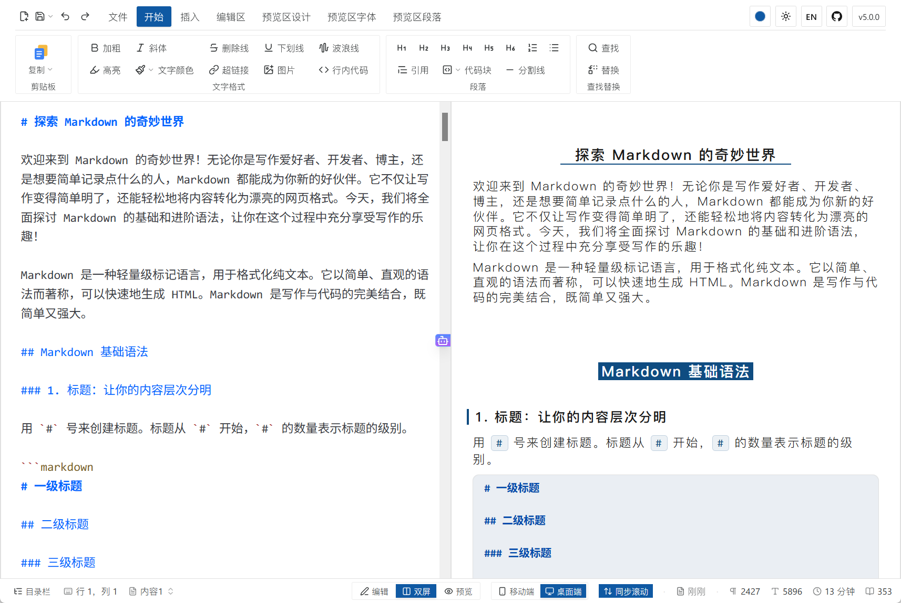

# 墨方 MoFang

> 一个 HTML 文件，一整套 Markdown 写作与排版工作台
> One HTML file. A complete Markdown writing and typesetting studio.

墨，谐音 Markdown 的首音。方，取方案之意。墨方即一种 Markdown 解决方案。

墨方是一个 Markdown 编辑器，也是一个排版工具。整个应用是一个静态 HTML 文件，下载后用浏览器打开即可使用。没有后端，无需登录，离线可用。

墨 (mò) means ink and echoes the first sound of _Markdown_. 方 (fāng) means
_solution_. Together: a Markdown solution.

MoFang is a Markdown editor and a typesetting tool. The entire application is
a single static HTML file: download it and open it in a browser. No backend,
no login, works offline.

## 在线体验 / Try it online

无需下载，直接在浏览器中打开：

Try it directly in your browser, no download needed:

**[zhangqihenry.github.io/mofang](https://zhangqihenry.github.io/mofang/)**

## 墨方的特点

- **一个文件就是全部**。整个应用打包为一个 HTML 文件，没有服务器、没有账号、没有安装过程。文稿与设置只保存在你自己的浏览器里，断网照样能用。

- **像 Word 一样顺手的功能区**。开始、插入、编辑区、预览区设计、预览区字体、预览区段落，命令按选项卡分组，鼠标悬停选项卡即可切换。

- **像排版软件一样精细**。先选正文或一至六级标题中的某一级，再单独设置它的字体（本地字体、自定义字体名、线上字体）、字号、字间距、行间距、段前与段后间距、对齐方式、首行缩进、文字颜色和边框。

- **页边距，所见即所得**。上下左右页边距同时作用于预览和导出的 HTML、PDF、长图。给手机长图顶部留出空白，不怕被刘海和灵动岛挡住。

- **主题可以存档**。内置经典、优雅、简洁、公文四款预览主题，改到满意可另存为自己的主题，随配置一起导出、带到别的电脑。预览主题色有 11 种预设、整套中国传统色系，也可以任意取色。

- **编辑区本身就是一个纯文本处理工具**。中英文标点一键转换，段首段尾空格、中西文之间空格、全角半角一键整理，一键清除 Markdown 标记还原为纯文本，一键格式化文档。

- **浅色、深色、跟随系统**。深色模式参照 iOS 外观体系逐色调校，而不是简单反色；长图可以分别导出浅色版和深色版。

- **网页内容粘贴后自动转换**。从网页复制的带格式内容粘贴进来，标题、加粗、链接、列表、表格会转换为对应的 Markdown 语法，而不是退化为纯文本。

- **修正中文加粗的渲染问题**。`**加粗**` 紧邻中文字符时，CommonMark 的强调规则常常失效，`**` 被原样显示。墨方在解析前做一次预处理，让中文加粗正常显示。

- **一键复制到公众号**。复制渲染后的排版结果，直接粘贴到公众号后台。

其它能力：

- Markdown 实时预览，编辑区与预览区同步滚动
- 数学公式（MathJax）、Mermaid 流程图、PlantUML 时序图（通过 `plantuml.com` 的公共服务渲染，需要联网）
- GFM 警告块、Ruby 注音、信息图、目录
- 代码高亮：代码块主题浅色、深色各一套，可选 Mac 样式与行号，代码字体可单独设置
- 导出 Markdown / HTML / PDF（可加页码与标题页眉）/ PNG 长图（浅色 / 深色）
- 自定义 CSS
- 图床（GitHub、S3、OSS、七牛云、MinIO、Cloudflare R2 等）与 AI 辅助写作（DeepSeek、OpenAI、通义千问等）需自行填写相应服务商的密钥，密钥仅保存在本地浏览器中
- 界面支持简体中文、繁體中文、English、日本語

## Why MoFang

- **One file is the whole thing**. The entire application is bundled into a
  single HTML file, with no server, no account and no installation step.
  Documents and settings live only in your own browser, and it keeps working
  offline.

- **A ribbon that feels like Word**. Home, Insert, Editor, Preview Design,
  Preview Font and Preview Paragraph: commands are grouped into tabs, and
  hovering a tab switches to it.

- **Typesetting-tool precision**. Pick the body text or any heading level from
  H1 to H6, then set its own font (local, any installed font by name, or a web
  font), size, letter spacing, line height, space before and after, alignment,
  first-line indent, text color and border.

- **Page margins, what you see is what you export**. Top, bottom, left and
  right margins apply to the preview and to HTML, PDF and long-image exports
  alike. Leave room at the top of a long image so a phone's notch or Dynamic
  Island never covers it.

- **Themes you can save**. Four built-in preview themes (Classic, Grace, Simple
  and Official Document); once you have tuned one, save it as your own and
  carry it to another computer with your exported settings. The theme color
  offers 11 presets, the full traditional Chinese color palette, or any color
  you pick.

- **The editor is a plain-text toolkit in its own right**. Convert punctuation
  between Chinese and ASCII, tidy leading, trailing and CJK–Latin spacing,
  swap full-width and half-width characters, strip Markdown back to plain text,
  or format the whole document, each in one click.

- **Light, dark or match system**. The dark mode is tuned color by color after
  iOS's appearance system rather than simply inverted, and long images export
  in either a light or a dark version.

- **Pasted web content is converted automatically**. Formatted content copied
  from a web page is converted on paste: headings, bold, links, lists and
  tables become the corresponding Markdown syntax rather than degrading to
  plain text.

- **CJK bold rendering is corrected**. When `**bold**` sits flush against
  Chinese characters, CommonMark's emphasis rules frequently fail and the
  literal `**` is shown. MoFang preprocesses the source so Chinese bold text
  renders as expected.

- **One-click copy for WeChat Official Accounts**. Copy the typeset result and
  paste it straight into the WeChat editor.

Other capabilities:

- Live Markdown preview, with the editor and preview scrolling in sync
- Math formulas (MathJax), Mermaid diagrams, PlantUML diagrams (rendered
  through the public `plantuml.com` service, which requires a network
  connection)
- GFM alert blocks, Ruby annotations, infographics, table of contents
- Syntax highlighting: separate light and dark code themes, optional Mac-style
  frame and line numbers, and a code font of its own
- Export to Markdown / HTML / PDF (with optional page numbers and title header)
  / PNG long image (light or dark)
- Custom CSS
- Image hosts (GitHub, S3, OSS, Qiniu, MinIO, Cloudflare R2, etc.) and
  AI-assisted writing (DeepSeek, OpenAI, Qwen, etc.) require credentials from
  the respective providers; credentials are stored only in the local browser
- Interface available in 简体中文, 繁體中文, English and 日本語

## 使用 / Usage

前往 [zhangqihenry/mofang](https://github.com/zhangqihenry/mofang) 下载
`mofang.html`，用浏览器打开即可，无需安装。

Download `mofang.html` from
[zhangqihenry/mofang](https://github.com/zhangqihenry/mofang) and open it in a
browser. No installation required.

## 注意事项 / Notes

- 未配置图床时，插入的图片以 base64 编码直接嵌入文档。该方式会显著增加文档体积。配置任一图床后即改为上传并引用链接。

- With no image host configured, inserted images are embedded directly in the
  document as base64 data URLs, which increases file size substantially.
  Configuring any image host switches to uploading and linking instead.

## 致谢 / Credits

墨方的主要灵感来自 [doocs/md](https://github.com/doocs/md)（WTFPL）。

网页内容粘贴后自动转换为 Markdown 的思路来自 [arya](https://github.com/nicejade/markdown-online-editor)（MIT）。

MoFang's main inspiration is [doocs/md](https://github.com/doocs/md) (WTFPL).

The idea of converting pasted web content into Markdown comes from
[arya](https://github.com/nicejade/markdown-online-editor) (MIT).

## License

[MIT](./LICENSE)
